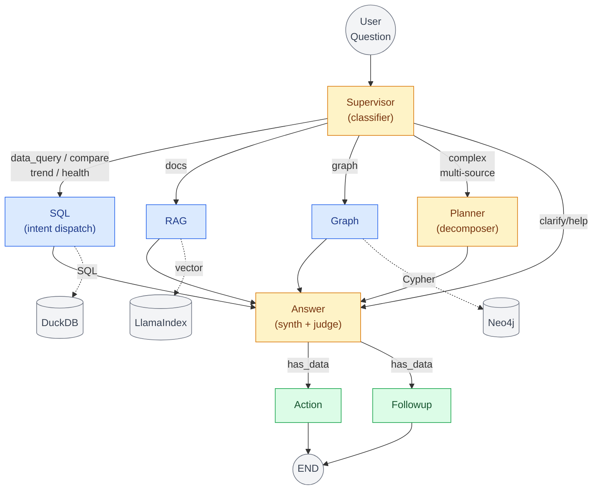
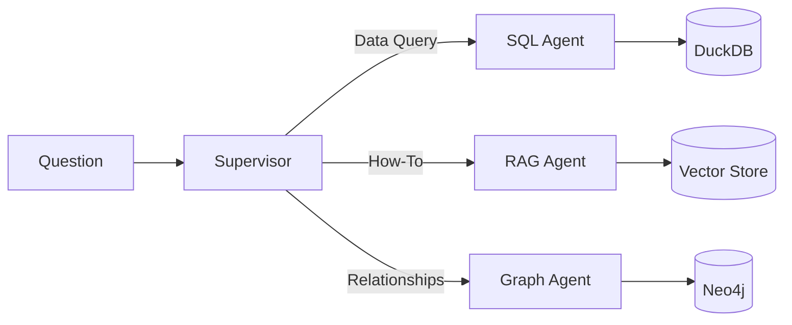
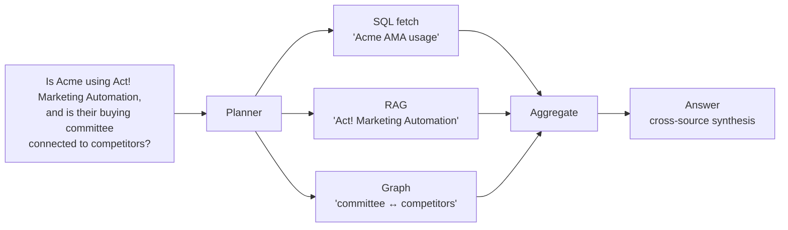
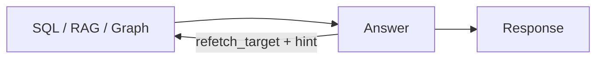
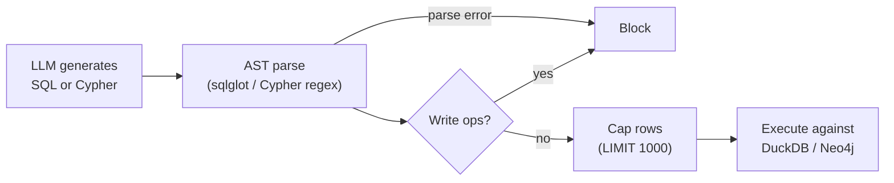
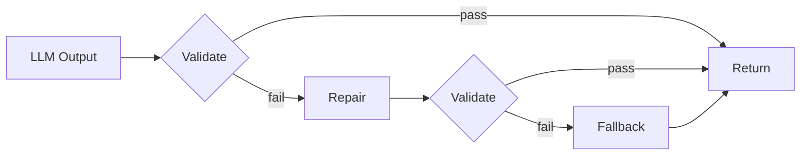
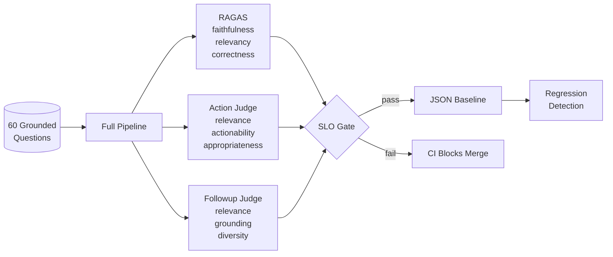

# CRM Agentic Reasoning Engine

**Multi-agent system that reasons over CRM data with grounded, evidence-backed answers.**

[](#quality)
[](#quality)
[](https://www.python.org/)
[](https://github.com/langchain-ai/langgraph)
[](https://www.llamaindex.ai/)
[](https://neo4j.com/)

<p align="center">
  <a href="https://crm-reasoning-engine.up.railway.app/">
    
  </a>
</p>

<p align="center">
  
</p>
<p align="center"><sub><em>Minimal React + SSE client for the demo UI.</em></sub></p>

---

## The Problem

An account manager prepping Acme's renewal asks: *"Is Acme actively using Act! Marketing Automation, and who on their buying committee is connected to our competitors?"*

This one question touches three sources — CRM data (AMA usage, renewal status), product docs (what Act! Marketing Automation covers), and entity relationships (buying committee, competitor connections). Naive approaches fall short — ungrounded LLMs fabricate, single-source RAG sees one facet, and SQL can't reason about documentation or relationships.

**This system is a multi-agent reasoning pipeline that orchestrates across heterogeneous sources.** A supervisor routes single-intent questions directly to the right data agent; a planner decomposes cross-source questions and fans out to SQL (DuckDB), RAG (LlamaIndex), and Graph (Neo4j) in parallel; the answer node weaves the evidence into one coherent response. Every claim cites its source with evidence tags (`[E#]` for SQL, `[D#]` for docs, `[G#]` for graph), and faithfulness is enforced via RAGAS SLOs in CI.

---

## Architecture



The pipeline is an **8-node LangGraph**: three reasoning agents (Supervisor, Planner, Answer — amber), three data tools (SQL, RAG, Graph — blue), and two response nodes (Action, Followup — green). The SQL tool internally dispatches on intent (`data_query`, `compare`, `trend`, `health`) to the right handler. Planner fan-out detail is in [§ Planner Cross-Source Fan-Out](#planner-cross-source-multi-agent-fan-out); Answer's source-targeted re-fetch is in [§ Re-Fetch Loop](#universal-re-fetch-loop). For additional topology and ASCII views, see [LangGraph Diagram](docs/LANGGRAPH_DIAGRAM.md).

> For example: "Show Q1 deals" → SQL, "How do I import contacts?" → RAG, "Who on Acme's team is connected to our competitors?" → Graph, "Is Acme using Act! Marketing Automation, and is their buying committee connected to competitors?" → Planner. See [ARCHITECTURE.md § Supervisor Routing](./docs/ARCHITECTURE.md#supervisor-routing) for the complete intent-to-agent mapping.

---

## Architecture

### Hybrid Knowledge: CRM Data + Documentation + Knowledge Graph

Three grounding sources in one system — each paired with the right retrieval modality:

| Question Type | Source | Technology |
|---------------|--------|------------|
| "What deals closed Q1?" | **CRM Data** | SQL → DuckDB |
| "How do I import contacts?" | **Product Docs** | LlamaIndex → Vector Search |
| "Who at at-risk companies has deals closing?" | **Knowledge Graph** | Cypher → Neo4j |



Same CRM data, different representations: DuckDB stores it as tables for aggregation queries; Neo4j stores it as a property graph for relationship traversal.

### Planner: Cross-Source Multi-Agent Fan-Out

When the supervisor detects a question that spans multiple sources (SQL + docs, SQL + graph, etc.), it routes to the planner. The planner decomposes the question into typed sub-queries (`fetch`, `compare`, `trend`, `rag`, `graph`) and fans them out in parallel. Results are aggregated into per-source keys (`data`, `comparisons`, `trends`, `rag_results`, `graph_results`) with per-source error lists for partial-failure synthesis:



### Re-Fetch Loop

The Answer node evaluates evidence sufficiency across **all three data sources** (SQL, RAG, Graph) and can request targeted re-fetch before responding (max 2 iterations, global cap):



When the LLM judges evidence insufficient, it sets `refetch_target` (one of `sql`, `rag`, `graph`) plus a freeform `refetch_hint`. Each source acts on the hint differently:

- **SQL**: re-invokes `sql_node` with the preserved intent and the refined question
- **RAG**: bumps `top_k` and appends the hint as a "Focus:" suffix to widen retrieval
- **Graph**: expands hop depth (2 → 3) and widens relationship types in the Cypher plan

Sufficiency evaluation runs as a separate lightweight judge chain, only invoked for multi-source evidence — pure-SQL latency is preserved. The max 2 iterations cap prevents runaway loops.

### Heuristics-First Classification

**90% of queries classified without LLM calls** — fast, cheap, deterministic.

How the 90% was measured: the supervisor classifies each incoming query using keyword/pattern matching first. Only when no pattern matches (ambiguous intent) does it fall back to an LLM call. Across the evaluation question set, ~90% of queries hit a deterministic pattern, avoiding LLM classification latency and cost entirely.

| Pattern | Intent | LLM Call? |
|---------|--------|-----------|
| "vs", "compare", "difference" | COMPARE | No |
| "trend", "over time", "growth" | TREND | No |
| "how do I", "how to" + Act! keyword | DOCS | No |
| "connected to", "relationship" | GRAPH | No |
| "health score", "at risk" | HEALTH | No |
| Matches patterns from >= 2 source buckets (SQL + docs, SQL + graph, etc.) | COMPLEX | No |
| Short or vague query | CLARIFY | No |
| Ambiguous intent | fallback | Yes |

**Why this matters:** Each LLM classification call adds ~500ms-1s latency and costs tokens. Heuristics-first routing keeps p50 latency low and reduces API costs, while the LLM fallback ensures no query goes unhandled.

## Grounding, Safety & Reliability

### Evidence-Grounded Responses

Every claim cites its source with traceable evidence tags — one tag type per data source:

```
Acme is using Act! Marketing Automation [D1] with 3 active campaigns [E1].
Their renewal is due Feb 15 [E2] and health score is at-risk [E3].
Maria (VP Sales) is connected to competitor Globex through a
shared board membership [G1].

Evidence:
- E1: activities.type = "AMA Campaign" WHERE company = "Acme" (3 rows)
- E2: companies.renewal_date = "2026-02-15" (row 12)
- E3: companies.health_status = "at-risk" (row 12)
- D1: act_docs/marketing_automation.pdf § "Campaign Management"
- G1: (Maria)-[:BOARD_MEMBER]->(TechBoard)<-[:BOARD_MEMBER]-(Globex VP)
```

**No citation = no claim.** The answer generator is constrained to only reference retrieved data:

1. The answer prompt instructs the LLM to only make claims backed by evidence from retrieved data
2. Each claim must include an evidence tag per source: `[E#]` for SQL, `[D#]` for docs, `[G#]` for graph
3. The evidence section maps each tag to its source: database row, document section, or graph path
4. Every claim is auditable — a reviewer can trace any fact back to the exact source

This grounding discipline is what enables the faithfulness SLO >= 0.85 (RAGAS) — responses are measured against retrieved context, and claims without evidence are penalized.

### Safety Guards

LLM-generated queries (SQL and Cypher) are validated before execution. Every query hits a guard that parses the AST, blocks write operations, and caps result size:



- **SQL guard** (`sqlglot`): blocks INSERT/DELETE/DROP/UPDATE, auto-injects `LIMIT 1000`, rejects dangerous functions.
- **Cypher guard** (read-only enforcement): blocks `CREATE`, `DELETE`, `DETACH`, `SET`, `REMOVE`, `MERGE`, `DROP`, `CALL`, `FOREACH`. Read-only traversals only, capped at 1000 results.

### Contract-Enforced Outputs

Every LLM output passes through: **Validate → Repair → Fallback**



**The system never crashes on malformed LLM output.** Pydantic contracts ensure type safety at every boundary.

## Evaluation

738 tests (unit + integration), 83% coverage. Plus 60 grounded evaluation questions covering all agent paths:

| Agent Path | Questions | What's Tested |
|------------|-----------|---------------|
| SQL — fetch | 10 | Single-table lookups, filters, aggregations |
| SQL — compare | 5 | A vs B comparisons across entities |
| SQL — trend | 5 | Time-series, growth patterns |
| SQL — health | 5 | Account health, renewal risk |
| RAG — docs | 10 | Act! CRM documentation queries |
| Graph | 10 | Entity relationships, multi-hop traversals |
| Planner | 10 | Cross-source decomposition (SQL+RAG, SQL+Graph, all three) |
| Clarify/Help | 5 | Vague, ambiguous, or meta queries |



### Quality Gates & SLOs

| Category | SLO | Threshold | Scope |
|----------|-----|-----------|-------|
| **Answer Quality (RAGAS)** | Faithfulness | ≥ 0.85 | Answer node |
| | Answer Relevancy | ≥ 0.85 | Answer node |
| | Answer Correctness | ≥ 0.35 | Answer node |
| **Output Quality (LLM-as-Judge)** | Action: Relevance, Actionability, Appropriateness | Pass rate ≥ 80% | Action node |
| | Followup: Relevance, Grounding, Diversity | Pass rate ≥ 80% | Followup node |
| **Performance** | p50 Latency | ≤ 3s | Full pipeline |
| | p95 Latency | ≤ 8s | Full pipeline |

### RAG Retrieval Strategy Comparison

Automated pipeline comparing **6 retrieval configurations** across 20 grounded questions using RAGAS metrics:

| Config | Retriever | Top-K | Reranker |
|--------|-----------|-------|----------|
| vector_top5 | Vector | 5 | None |
| vector_top10 | Vector | 10 | None |
| bm25_top5 | BM25 | 5 | None |
| hybrid_top5 | Vector + BM25 (RRF) | 5 | None |
| vector_top10_rerank5 | Vector | 10 | SentenceTransformer |
| hybrid_top10_rerank5 | Vector + BM25 | 10 | SentenceTransformer |

Winner selected by composite score: `0.4 * relevancy + 0.4 * faithfulness + 0.2 * correctness`

**Why these weights?** Relevancy and faithfulness are weighted equally at 0.4 each because they represent the two most critical qualities: the answer must address the question (relevancy) and must be grounded in retrieved context (faithfulness). Correctness is weighted lower at 0.2 because semantic similarity to a reference answer is sensitive to phrasing differences — a correct answer worded differently can score low on correctness but still be faithful and relevant.

The comparison pipeline runs all 6 configs against the same 20 grounded questions (questions with known correct answers), computes RAGAS metrics for each, and ranks by composite score to select the best configuration for production use.

---

## Tech Stack

### Multi-Model Strategy

Different models for different task complexities — not a single model for everything:

| Task | Node | Model | Why |
|------|------|-------|-----|
| **SQL Generation** | SQL | Claude Sonnet | Precise structured output for query syntax |
| **Cypher Generation** | Graph | Claude Sonnet | Graph query syntax needs precision |
| **Answer Synthesis** | Answer | GPT-5.4 | Complex multi-source reasoning + citation formatting |
| **Sufficiency Judge** | Answer | GPT-5.4-mini | Reasoning about evidence gaps for re-fetch |
| **Intent Classification (fallback)** | Supervisor | GPT-5.4-mini | LLM fallback when heuristics don't match |
| **Query Decomposition** | Planner | GPT-5.4-mini | Decompose complex questions into sub-queries |
| **Action Suggestions** | Action | GPT-5.4-nano | Simple creative output |
| **Follow-up Generation** | Followup | GPT-5.4-nano | Simple question generation |
| **Contract Validation (validate → repair → fallback)** | Answer, Action, Followup | GPT-5.4-nano | Check + fix LLM outputs across all terminal nodes |
| **Embeddings** | RAG | text-embedding-3-small | Vector similarity for retrieval |

Three model tiers: Claude for structured code generation, GPT-5.4 for complex reasoning, GPT-5.4-mini for moderate tasks, GPT-5.4-nano for high-volume lightweight tasks.

### Tech Stack

| Component | Technology | Why This Choice |
|-------|------------|-----------------|
| **Orchestration** | LangGraph | Stateful workflows, conditional edges, checkpointing |
| **RAG Pipeline** | LlamaIndex | Hybrid vector + BM25 retrieval |
| **Graph DB** | Neo4j | Multi-hop entity traversal, Cypher queries |
| **Analytics DB** | DuckDB | Columnar storage, fast aggregations, zero config |
| **Evaluation** | RAGAS | Faithfulness, relevancy, correctness metrics |
| **Backend** | FastAPI | Async, OpenAPI docs, Pydantic validation |
| **Streaming** | Server-Sent Events | Real-time token streaming from agent pipeline |

---

## Documentation

- [Architecture Decisions](docs/ARCHITECTURE.md) — Design rationale and trade-offs
- [Data Flow](docs/data-flow.md) — Stage-by-stage request lifecycle
- [LangGraph Diagram](docs/LANGGRAPH_DIAGRAM.md) — Visual agent topology

---

<p align="center">
  <strong>Built by <a href="https://github.com/sazzad-kamal">Sazzad Kamal</a></strong>
</p>
