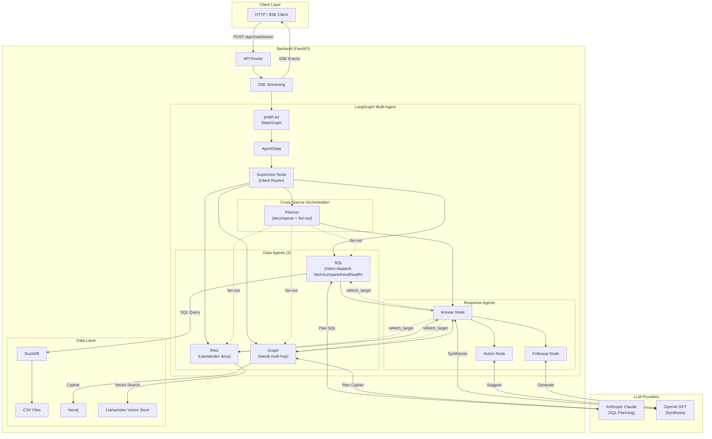
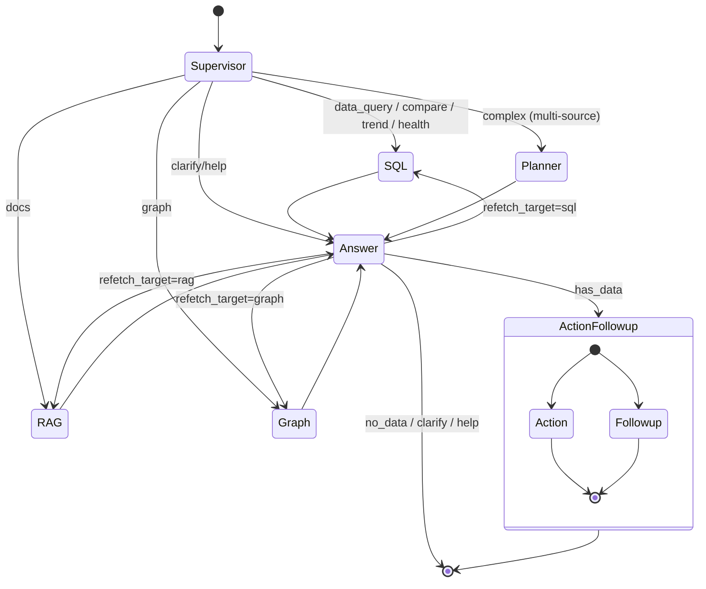
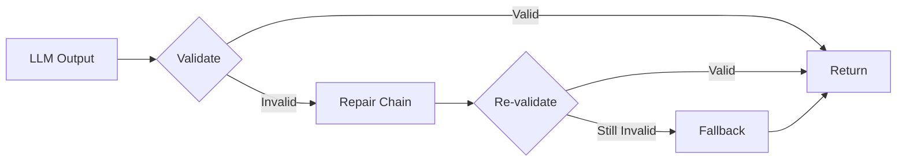
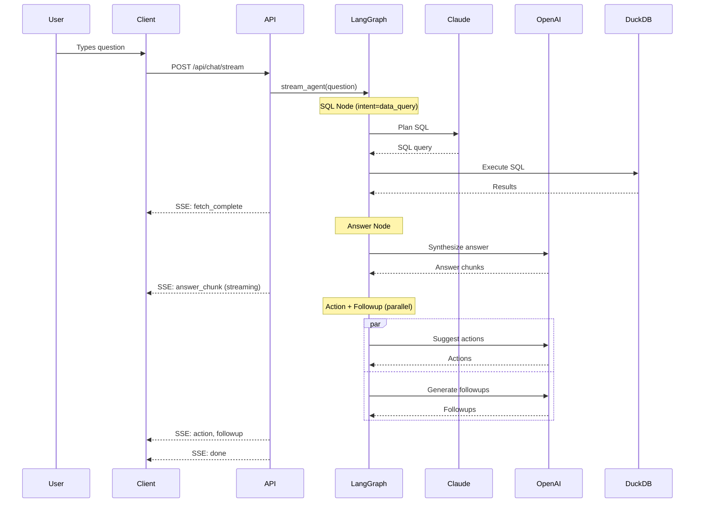

# Architecture

This document describes the system architecture of the CRM Agentic Reasoning Engine.

## Overview

The system is a multi-agent reasoning engine that answers natural language questions about CRM data. It uses an **8-node LangGraph pipeline** for:

- **Supervisor routing**: Classifies intent and detects cross-source questions, routing single-intent queries directly to their data agent and multi-source queries to the planner
- **3 Data Agents**: SQL (dispatches internally on `data_query`/`compare`/`trend`/`health`), RAG (LlamaIndex documentation search), Graph (Neo4j multi-hop)
- **Planner**: Decomposes cross-source questions into typed sub-queries (`fetch`, `compare`, `trend`, `rag`, `graph`) and fans out in parallel
- **Response Agents**: Answer (evidence-grounded synthesis + universal re-fetch judge), Action, Followup
- **Universal re-fetch loop**: Answer node evaluates evidence sufficiency across all three sources and issues targeted re-fetch (max 2 iterations)
- **Hybrid grounding**: SQL → DuckDB for data, LlamaIndex for documentation, Neo4j for relationships

## System Diagram



## Agent Pipeline

The agent uses LangGraph to orchestrate a **multi-agent pipeline** with Supervisor routing and specialized agents:



### Supervisor Routing

The Supervisor node classifies user intent and routes to the appropriate data agent, the planner, or directly to Answer:

| Intent | Description | Route | Example |
|--------|-------------|-------|---------|
| `data_query` | Simple CRM data lookup | SQL (fetch handler) → Answer | "Show all deals" |
| `compare` | Compare two entities | SQL (compare handler) → Answer | "Q1 vs Q2 revenue" |
| `trend` | Time-series analysis | SQL (trend handler) → Answer | "Revenue trend by month" |
| `health` | Account health score | SQL (health handler) → Answer | "Acme's health score" |
| `docs` | Product documentation | RAG → Answer | "How do I import contacts?" |
| `graph` | Multi-hop relationships | Graph → Answer | "Who at at-risk companies has deals closing?" |
| `complex` | Cross-source / multi-part queries | Planner → fan-out → Answer | "Is Acme using Act! Marketing Automation and is their buying committee connected to competitors?" |
| `clarify` | Question is vague | Answer (asks for clarification) | "yes" |
| `help` | User wants help | Answer (describes capabilities) | "what can you do?" |

**Multi-source detection**: the classifier's heuristic pipeline ends with a cross-source rule. If a question matches patterns from two or more of {SQL, docs, graph} buckets — e.g., SQL keywords + docs keywords — it is classified as `complex` and routed to the planner rather than to any single data agent. The `data_query`/`compare`/`trend`/`health` intents remain distinct strings in state because `sql_node` dispatches on them internally.

### Universal Re-fetch Loop

The Answer node can detect when more evidence is needed across any data source:

1. Answer generates a response from whatever source(s) ran. When evidence spans multiple sources, a lightweight judge chain evaluates sufficiency per source (pure-SQL answers bypass the judge to preserve latency).
2. If insufficient, the LLM emits `needs_more_data=True`, `refetch_target` (one of `sql`, `rag`, `graph`), and a freeform `refetch_hint`.
3. `_route_after_answer` dispatches back to the targeted source:
   - **SQL**: re-invokes `sql_node` with the preserved intent.
   - **RAG**: bumps `top_k` and appends the hint as "Focus: ..." to widen retrieval.
   - **Graph**: expands hop depth (2 → 3) and widens relationship types in the Cypher plan.
4. Global cap of 2 iterations prevents runaway loops.

### Node Responsibilities

#### 0. Supervisor Node (`backend/agent/supervisor/`)

**Purpose**: Classify user intent and route to appropriate handler.

**Components**:
- `classifier.py`: Intent classification with heuristics + LLM fallback
- `node.py`: LangGraph node that returns intent and loop count

**Classification Logic**:
```
1. Quick heuristics (no LLM call):
   - Short/vague input → CLARIFY
   - Help phrases → HELP
   - Compare keywords (vs, compare) → COMPARE
   - Trend keywords (trend, growth) → TREND
   - Health keywords → HEALTH
   - Relationship keywords → GRAPH
   - Docs keywords (how do I, Act! + how-to) → DOCS
   - Data indicators → DATA_QUERY
   - Cross-source rule: matches patterns from >= 2 of {SQL, docs, graph} → COMPLEX
     (routes to planner rather than any single agent)

2. LLM fallback for ambiguous cases:
   - Uses GPT-4o-mini for classification
   - Returns one of the intents above
```

**Why Supervisor?**: Avoids running expensive SQL planning for non-data questions. Routes cross-source questions to the planner so no single agent is asked to reason outside its domain.

#### 1. SQL Agent (`backend/agent/sql/`)

**Purpose**: Handle all structured-data questions. A single `sql_node` dispatches on `state["intent"]` to one of four handlers, so "8 agents" collapses into one coherent SQL agent with four modes.

**Layout**:
- `node.py`: `sql_node(state)` — dispatcher. Picks handler by intent.
- `intents/fetch.py`: `data_query` — simple SQL retrieval.
- `intents/compare.py`: `compare` — A vs B analysis with parallel SQL.
- `intents/trend.py`: `trend` — time-series with granularity detection.
- `intents/health.py`: `health` — weighted account-health scoring.
- `planner.py`: Claude-based SQL planner (shared).
- `guard.py`: sqlglot safety validation (shared).
- `executor.py`: DuckDB execution (shared).
- `schema.py` / `schema.yaml`: schema context for the planner.
- `connection.py`: thread-local DuckDB connection + CSV loading.

**Flow**:
```
Question + intent → handler → Claude (SQL Planning) → guard → DuckDB → post-processing
```

**Compare output**:
```python
{
    "comparison": {
        "entity_a": "Q1",
        "entity_b": "Q2",
        "metrics": {
            "revenue": {"Q1": 100000, "Q2": 150000, "difference": 50000, "percent_change": 50.0}
        }
    }
}
```

**Trend output**:
```python
{
    "trend_analysis": {
        "direction": "increasing",
        "percent_change": 25.5,
        "volatility": 12.3,
        "period_changes": [10.0, 15.0, 20.0]
    }
}
```

**Why Claude?**: Claude provides better structured output for SQL generation with fewer hallucinated column names.

#### 1.1 Planner Agent (`backend/agent/planner/`)

**Purpose**: Orchestrate cross-source multi-step questions.

**Capabilities**:
- Decomposes complex questions into typed sub-queries (`fetch`, `compare`, `trend`, `rag`, `graph`).
- Dispatches each sub-query: SQL-family types route to `sql_node` with the right intent; `rag` routes to `rag_node`; `graph` routes to `graph_node`.
- Runs sub-queries in parallel and aggregates results under per-source keys.
- Fallback chain: unknown sub-query types and LLM parse failures route through the supervisor classifier for second-chance classification rather than silently defaulting.

**Aggregated output shape**:
```python
{
    "subqueries": [...],        # per-subquery metadata
    "data": {...},              # fetch results
    "comparisons": [...],       # compare results
    "trends": [...],            # trend results
    "rag_results": [...],       # {question, answer, sources, confidence}
    "graph_results": [...],     # {question, graph_data, debug}
    "sql_errors": [...],        # per-source error lists
    "rag_errors": [...],
    "graph_errors": [...],
}
```

Partial-failure contract: if N-1 of N sub-queries succeed, the aggregator returns successful results plus populated `*_errors` lists. The Answer node synthesizes from available evidence and caveats missing pieces.

**Flagship example**:
```
"For Acme's renewal, is Acme using Act! Marketing Automation,
 and who on their buying committee is connected to our competitors?"
  1. fetch : "Acme AMA usage + renewal status"                  → SQL
  2. rag   : "Act! Marketing Automation"                        → RAG
  3. graph : "Acme buying committee ↔ competitor connections"   → Graph
  → Aggregated results → Answer (cross-source synthesis)
```

#### 1.2 Health Score (`backend/agent/sql/intents/health.py`)

**Purpose**: Calculate account health metrics and provide insights. Invoked via the SQL dispatcher when intent is `health`.

**Metrics**:
| Factor | Weight | Description |
|--------|--------|-------------|
| Deal Value | 25% | Total value of deals (log scale) |
| Deal Count | 15% | Number of deals |
| Win Rate | 20% | Won deals / closed deals |
| Activity Recency | 15% | Days since last activity |
| Pipeline Coverage | 15% | Open vs closed deal ratio |
| Renewal Status | 10% | Upcoming renewals |

**Output**:
```python
{
    "health_analysis": {
        "score": 78.5,
        "grade": "C",
        "insights": ["No activity in 45 days - schedule a check-in"]
    }
}
```

#### 1.3 RAG Agent (`backend/agent/rag/`)

**Purpose**: Answer "how-to" questions using Act! CRM documentation.

**Technology**: LlamaIndex with OpenAI embeddings

**Components**:
- `indexer.py`: Loads PDF documents and creates vector index
- `retriever.py`: Semantic search over documentation
- `node.py`: LangGraph node that returns grounded answers

**Capabilities**:
- Semantic search over Act! CRM documentation PDFs
- Retrieves relevant document chunks
- Synthesizes answers grounded in source material
- Returns source citations for transparency

**Why RAG?**: Users often need help with CRM features, not just data queries. RAG provides grounded answers from official documentation instead of hallucinated responses.

**Output**:
```python
{
    "rag_answer": "To import contacts, go to File > Import...",
    "rag_sources": [
        {"id": "D1", "source": "quick-start.pdf", "excerpt": "..."},
    ],
    "rag_confidence": 0.85
}
```

#### 1.4 Graph Agent (`backend/agent/graph_rag/`)

**Purpose**: Answer multi-hop relationship questions using Neo4j knowledge graph.

**Components**:
- `connection.py`: Neo4j driver with lazy init and CSV data loading
- `planner.py`: Uses Claude to generate Cypher queries
- `guard.py`: Validates Cypher is read-only (blocks CREATE, DELETE, SET, MERGE)
- `executor.py`: Executes Cypher against Neo4j
- `schema.yaml`: Graph model definition (nodes, relationships, properties)
- `node.py`: LangGraph node that orchestrates plan → guard → execute

**Example**:
```
"Who at at-risk companies has deals closing this month?"
→ MATCH (c:Company)-[:HAS_CONTACT]->(ct:Contact),
        (c)-[:HAS_OPPORTUNITY]->(o:Opportunity)
  WHERE c.health_status CONTAINS 'at-risk'
    AND o.expected_close_date >= date().toString()
  RETURN ct.first_name, ct.last_name, c.name, o.name, o.amount
```

#### 2. Answer Node (`backend/agent/answer/`)

**Purpose**: Synthesize a human-readable answer from the data.

**Key Features**:
- Evidence tagging: Claims are linked to data via `[E1]`, `[E2]` markers
- Strict grounding: Only facts from retrieved data are allowed
- Structured output: Answer / Evidence / Data not available sections
- **Contract validation**: validate → repair → fallback pipeline

**Prompt Contract**:
```
You MUST:
- Only use facts from CRM DATA section
- Tag each claim with evidence markers [E1], [E2]...
- List evidence sources at the end
- Say "I don't have that information" if data is missing
```

**Contract Enforcement** (`backend/agent/validate/`):

Every response goes through a contract validation pipeline:



| Validator | Checks | Repair Strategy |
|-----------|--------|-----------------|
| Answer | Evidence tags, sections | Re-prompt with format instructions |
| Action | Numbered list, word count, owner prefix | Re-prompt with examples |
| Followup | Exactly 3 questions, max 10 words | Re-prompt with constraints |

**Grounding Verifier** (`backend/agent/validate/grounding.py`):

LLM-based critic that verifies claims are supported by CRM data:

```python
# Verification process
1. Extract all factual claims from answer
2. For each claim, check if data supports it
3. Flag ungrounded or hallucinated claims
```

#### 3. Action Node (`backend/agent/action/`)

**Purpose**: Suggest actionable next steps based on the answer.

**Output**: 1-4 action suggestions (or NONE if not applicable)

**Examples**:
- "Export this data to CSV"
- "Schedule a follow-up call"
- "Create a renewal reminder"

#### 4. Followup Node (`backend/agent/followup/`)

**Purpose**: Generate relevant follow-up questions.

**Strategy**:
1. First, try static followup tree (fast, deterministic)
2. If no match, use LLM to generate schema-aware questions

**Output**: Exactly 3 follow-up questions, each under 10 words.

## Data Flow

### Request Flow



### State Schema

```python
class AgentState(TypedDict):
    # Input
    question: str              # User's input question

    # Supervisor routing
    intent: str                # "data_query" | "compare" | "trend" | "health" | "docs" | "graph" | "complex" | etc.
    loop_count: int            # Track Data→Answer iterations (global cap of 2)
    needs_more_data: bool      # Answer signals it needs additional data
    refetch_target: str | None # "sql" | "rag" | "graph" | None — which source to re-invoke
    refetch_hint: str | None   # Freeform hint (e.g., "broaden doc scope", "expand hop depth")

    # Data (source-prefixed keys in a single dict)
    sql_results: dict          # {sql, data, comparison, trend_analysis, health_analysis,
                               #  rag_answer, rag_sources, graph_data, _debug, ...}

    # Outputs
    answer: str                # Synthesized answer
    suggested_action: str      # Action suggestions
    follow_up_suggestions: list[str]  # Follow-up questions
```

## LLM Strategy

### Multi-Provider Design

| Task | Provider | Model | Reason |
|------|----------|-------|--------|
| SQL Planning | Anthropic | Claude | Better structured output, fewer hallucinations |
| Cypher Planning | Anthropic | Claude | Same structured output advantage for graph queries |
| Answer Synthesis | OpenAI | GPT | Good at natural language synthesis |
| Action Suggestions | OpenAI | GPT | Creative suggestions |
| Followup Generation | OpenAI | GPT | Question generation |
| 5-Dim Answer Judge | OpenAI | GPT | Structured scoring across 5 dimensions |
| Intent Classification (fallback) | OpenAI | GPT-4o-mini | Fast, cheap fallback for ambiguous queries |

### Fallback Behavior

If Anthropic API is unavailable, the system falls back to OpenAI for SQL planning.

## Streaming Architecture

The system uses Server-Sent Events (SSE) for real-time updates:

```python
# Event types
fetch_start      # Data-agent node started (SQL/RAG/Graph)
fetch_complete   # Data retrieval complete (SQL row count, RAG sources, Graph nodes/edges)
answer_chunk     # Streaming answer token
action           # Action suggestions ready
followup         # Follow-up questions ready
done             # Pipeline complete
error            # Error occurred
```

## Evaluation Framework

The system includes a comprehensive evaluation framework with:
- **RAGAS metrics** for answer quality (faithfulness, relevancy, correctness)
- **5-Dimension LLM Judge** scoring grounding, completeness, clarity, accuracy, actionability
- **RAG Comparison Pipeline** evaluating 6 retrieval strategies across 20 grounded questions
- **Versioned eval cases** with checksums for reproducibility
- **Latency tracking** per question with percentile SLOs
- **Regression gate** for CI/CD integration with JSON baseline export

### Metrics

Two eval suites enforce separate SLO sets. Integration eval covers the end-to-end conversation pipeline; follow-up eval covers follow-up question generation quality.

#### Integration Eval SLOs (`backend/eval/integration/`)

| Metric | Description | SLO |
|--------|-------------|-----|
| Pass Rate | Questions that meet all quality thresholds | ≥ 0.95 |
| Faithfulness | Claims grounded in retrieved data | ≥ 0.85 |
| Answer Relevancy | Answer addresses the question | ≥ 0.85 |
| Answer Correctness | Semantic match with expected answer | ≥ 0.35 [^ac] |
| p50 Latency | Median response time | ≤ 3000ms |
| p95 Latency | 95th percentile response time | ≤ 8000ms |

[^ac]: Lenient semantic-match floor — does not penalize phrasing/style differences. Strict grounding is enforced separately by faithfulness ≥ 0.85.

#### Follow-up Eval SLOs (`backend/eval/followup/`)

| Metric | Description | SLO |
|--------|-------------|-----|
| Pass Rate | Follow-up sets meeting all quality thresholds | ≥ 0.80 |
| Question Relevance | Follow-ups relate to the original question/answer | ≥ 0.60 |
| Answer Grounding | Follow-ups grounded in available data | ≥ 0.50 |
| Diversity | Variety across the 3 generated follow-ups | ≥ 0.50 |
| Answerability | Follow-ups can be answered by the system | ≥ 0.70 |

### Eval Cases Versioning

```python
# backend/eval/shared/version.py
EVAL_CASES_VERSION = "1.0.0"  # Semantic version

# Each run records:
# - Version number
# - SHA256 checksum of questions.yaml
# - Stats (total questions, difficulty breakdown)
```

### Running Evaluations

```bash
# Full conversation evaluation
python -m backend.eval.integration [--limit N] [--output results.json]

# Regression gate (fails if SLOs not met)
python -m backend.eval.integration.gate [--baseline baseline.json]

# Answer quality evaluation
python -m backend.eval.answer

# Followup quality evaluation
python -m backend.eval.followup

# RAG retrieval strategy comparison
python -m backend.eval.rag_comparison [--limit N] [--configs vector_top5,hybrid_top5]
```

### Regression Gate

The gate command (`python -m backend.eval.integration.gate`) provides CI/CD integration:

```bash
# Run with baseline comparison
python -m backend.eval.integration.gate --baseline baseline.json

# Exit codes:
# 0 = All SLOs passed
# 1 = SLO failures or regressions detected
```

Regression thresholds:
- Pass rate: Allow 2% drop from baseline
- Quality metrics: Allow 5% drop from baseline
- Latency: Allow 20% increase from baseline

## CI/CD Pipeline

### CI (GitHub Actions)

Two workflows protect `main`:

**`.github/workflows/backend.yml`** — runs on push to `main` when backend code, tests, or dependencies change. Jobs (run in parallel where dependencies allow):

- **Lint & Type Check**: `ruff check backend/` (E/F/W rules) and `mypy backend/ --ignore-missing-imports`.
- **Agent Tests**: `pytest tests/backend/agent/` with `MOCK_LLM=1` (no live LLM calls). The SQL agent's per-intent handlers (`fetch`, `compare`, `trend`, `health`) are covered under `tests/backend/agent/sql/` (one file per handler plus `test_dispatch.py` for the `sql_node` dispatcher), and the flagship cross-source integration test lives at `tests/backend/agent/test_flagship_cross_source.py`.
- **Core Backend Tests**: `pytest tests/backend/` excluding the agent subtree (middleware, API, clients).
- **Coverage**: reruns the full backend suite under `pytest --cov=backend` and uploads `coverage.xml` to Codecov (non-blocking).
- **Quality Gate (SLO Enforcement)**: `python -m backend.eval.integration.gate --limit 5` — enforces the RAGAS faithfulness/relevancy/correctness SLOs, the 5-dimension LLM-judge pass rate, and the p50/p95 latency SLOs documented above. Gated behind `workflow_dispatch` so the full eval runs on demand rather than every push.

**`.github/workflows/e2e.yml`** — runs on push to `main` when either backend or frontend code changes. Builds the frontend, installs Playwright (chromium), boots the backend under `MOCK_LLM=1`, waits on `/api/health`, then runs the Playwright suite against the live server. Playwright HTML reports upload as an artifact on failure.

### CD (Railway)

Deployment is continuous from `main` via the Railway GitHub integration: a push to `main` triggers a Railway build using the repo `Dockerfile` (per `railway.toml` → `builder = "DOCKERFILE"`) and rolls out automatically. The platform then polls the healthcheck defined in `railway.toml`:

- `healthcheckPath = "/api/health"`
- `healthcheckTimeout = 300`
- `restartPolicyType = "ON_FAILURE"` with `restartPolicyMaxRetries = 3`

A container that fails `/api/health` within 300s, or crashes post-start, is restarted up to 3 times before the deploy is marked failed.

### Failure Modes

A PR or push is blocked / a deploy is rejected when any of the following gates trip:

- Ruff reports any E/F/W violation (excluding the ignored rules).
- `mypy` reports a type error outside `--ignore-missing-imports` scope.
- Any `pytest` test fails in the agent or core backend jobs.
- Playwright E2E: backend fails to answer `/api/health` within 30s, the frontend build fails, or any Playwright spec fails.
- Quality gate (manual dispatch): any RAGAS / judge / latency SLO falls below its threshold, or regression-gate drift exceeds the configured allowance.
- Railway deploy: `/api/health` does not return success within the 300s timeout after 3 restart attempts.

Coverage upload and the `--limit 5` quality gate run `continue-on-error: true` for the Codecov step only; the gate itself is authoritative when dispatched.

## Security Considerations

### SQL Safety Guard (`backend/agent/sql/guard.py`)

All SQL queries pass through a safety guard before execution:

```python
# Blocked operations
INSERT, UPDATE, DELETE, DROP, CREATE, ALTER, GRANT

# Blocked functions
read_csv (prevents file access)

# Safety measures
- Auto-adds LIMIT 1000 to prevent memory exhaustion
- Validates with sqlglot parsing
- Logs blocked queries for monitoring
```

### Cypher Safety Guard (`backend/agent/graph_rag/guard.py`)

All Cypher queries pass through a read-only guard before execution:

```python
# Blocked operations
CREATE, DELETE, DETACH, SET, REMOVE, MERGE, DROP, CALL, FOREACH

# Safety measures
- Auto-adds LIMIT 1000 to prevent unbounded traversals
- Keyword-based validation (no AST parser available for Cypher)
```

### Current State
- **SQL Guard**: All LLM-generated SQL is validated before execution
- **Cypher Guard**: All LLM-generated Cypher is validated for read-only access
- **Input validation**: Pydantic models for request/response
- **CORS**: Restricted to allowed origins
- **Evidence grounding**: Answers must cite data sources

### Recommended Improvements
- Rate limiting on API endpoints
- Query result caching with TTL
- Audit logging for all SQL executions

## Performance

### Latency Breakdown (typical)

| Stage | Latency |
|-------|---------|
| SQL Planning (Claude) | 500-800ms |
| SQL Execution (DuckDB) | 10-50ms |
| Answer Synthesis (GPT) | 1-2s |
| Action + Followup | 500ms |
| **Total** | **2-3.5s** |

### Optimization Opportunities
- Parallel LLM calls where possible
- Caching for common queries
- Streaming reduces perceived latency
