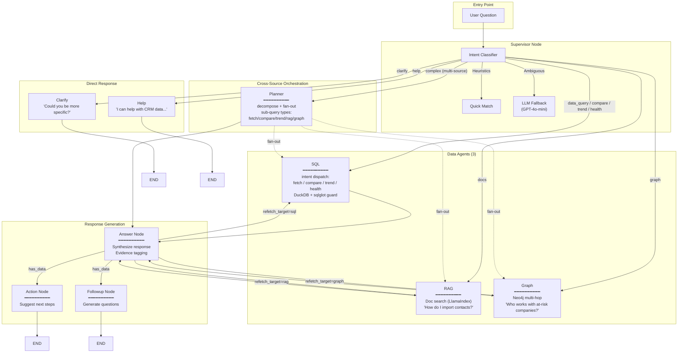

# LangGraph Multi-Agent Architecture

> For full architecture context (agent responsibilities, state schema, data flow sequence), see [ARCHITECTURE.md](./ARCHITECTURE.md). This file focuses on the visual topology and ASCII diagrams.

## Complete Flow Diagram



**8-node topology**: Supervisor, SQL, RAG, Graph, Planner, Answer, Action, Followup.

## Intent Classification

```
┌─────────────────────────────────────────────────────────────────┐
│                    INTENT CLASSIFIER                             │
├─────────────────────────────────────────────────────────────────┤
│                                                                  │
│  Input: "Compare Q1 vs Q2 revenue"                              │
│                                                                  │
│  1. HEURISTICS (fast, no API call)                              │
│     ├── Length < 4 chars? ──────────────────────> CLARIFY       │
│     ├── Help priority phrases? ─────────────────> HELP          │
│     ├── Compare keywords (vs, compare)? ────────> COMPARE  ✓    │
│     ├── Trend keywords? ────────────────────────> TREND         │
│     ├── Health keywords? ───────────────────────> HEALTH        │
│     ├── Docs keywords (Act! + how-to)? ─────────> DOCS          │
│     ├── Relationship keywords? ─────────────────> GRAPH         │
│     ├── Data indicators? ───────────────────────> DATA_QUERY    │
│     └── Cross-source: matches >=2 of {SQL, docs, graph}         │
│         ─────────────────────────────────────> COMPLEX          │
│                                                                  │
│  2. LLM FALLBACK (if no heuristic match)                        │
│     └── GPT-4o-mini classification                              │
│                                                                  │
│  Output: Intent.COMPARE                                          │
│                                                                  │
└─────────────────────────────────────────────────────────────────┘
```

## Agent Details

### Data Agents (3)

| Agent | Intent(s) handled | Input | Output key(s) | Example |
|-------|-------------------|-------|---------------|---------|
| **SQL** | `data_query`, `compare`, `trend`, `health` | Question + intent | `data`, `comparison`, `trend_analysis`, `health_analysis` | "Show all deals" / "Q1 vs Q2 revenue" / "Revenue by month" / "Acme health score" |
| **RAG** | `docs` | Question | `rag_answer`, `rag_sources`, `rag_confidence` | "How do I import contacts in Act!?" |
| **Graph** | `graph` | Question | `graph_data`, `graph_debug` | "Who at at-risk companies has deals closing?" |

### Cross-Source Orchestration

| Node | Intent | Purpose |
|------|--------|---------|
| **Planner** | `complex` | Decompose into typed sub-queries (`fetch`, `compare`, `trend`, `rag`, `graph`), fan out in parallel, aggregate into per-source keys (`data`, `comparisons`, `trends`, `rag_results`, `graph_results`) plus per-source error lists (`sql_errors`, `rag_errors`, `graph_errors`). Unknown types and parse failures fall back through the supervisor classifier. |

### Response Agents

| Agent | Purpose | Input | Output |
|-------|---------|-------|--------|
| **Answer** | Synthesize response | `sql_results` | `answer` with evidence tags |
| **Action** | Suggest next steps | `answer` | `suggested_action` |
| **Followup** | Generate questions | `answer` | `follow_up_suggestions` |

### Contract Validation Layer

Every response agent output passes through a contract validator:

```
┌─────────────────────────────────────────────────────────────────┐
│                   CONTRACT VALIDATION                            │
├─────────────────────────────────────────────────────────────────┤
│                                                                  │
│  LLM Output ──> Validate ──> Valid? ──> Return                  │
│                    │                                             │
│                    │ Invalid                                     │
│                    ▼                                             │
│              Repair Chain ──> Re-validate ──> Valid? ──> Return │
│                                    │                             │
│                                    │ Still Invalid               │
│                                    ▼                             │
│                              Fallback ──> Return                 │
│                                                                  │
│  Validators:                                                     │
│  ├── Answer: Evidence tags, sections, grounding                 │
│  ├── Action: Numbered list, word count (≤28), owner prefix      │
│  └── Followup: Exactly 3 questions, word count (≤10)            │
│                                                                  │
└─────────────────────────────────────────────────────────────────┘
```

## Data Flow Example

```
User: "Compare Q1 vs Q2 revenue"
        │
        ▼
┌─────────────────┐
│   Supervisor    │──> Intent: COMPARE
└────────┬────────┘
         │
         ▼
┌──────────────────────┐
│  SQL Node            │
│  (intent=compare)    │
│  ┌────────────────┐  │
│  │ Dispatch to    │  │──> intents/compare.py
│  │ compare handler│  │
│  └──────┬─────────┘  │
│         │            │
│  ┌──────▼─────────┐  │
│  │ Extract        │  │──> entity_a: "Q1", entity_b: "Q2"
│  │ Entities       │  │
│  └──────┬─────────┘  │
│         │            │
│  ┌──────▼─────────┐  │
│  │ SQL for A + B  │  │──> parallel SELECTs, guarded by sqlglot
│  └──────┬─────────┘  │
│         │            │
│  ┌──────▼─────────┐  │
│  │ Calculate      │  │──> diff: +50000, pct: +25%
│  │ Metrics        │  │
│  └────────────────┘  │
└──────────┬───────────┘
         │
         ▼
┌─────────────────┐
│  Answer Node    │──> "Q2 revenue increased 25% vs Q1 [E1]"
└────────┬────────┘
         │
    ┌────┴────┐
    ▼         ▼
┌───────┐ ┌────────┐
│Action │ │Followup│
└───────┘ └────────┘
    │         │
    ▼         ▼
"Export"  "Show Q3?"
```

